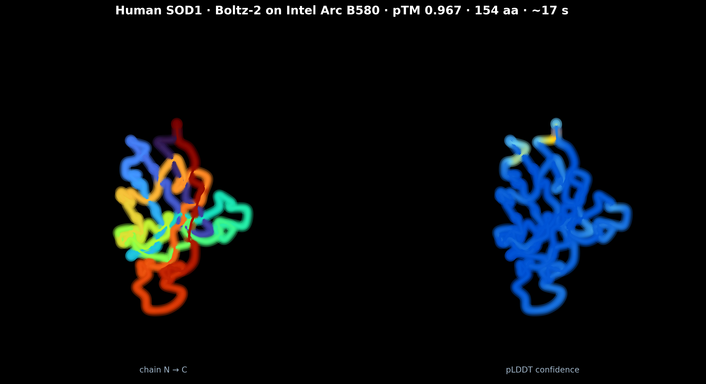
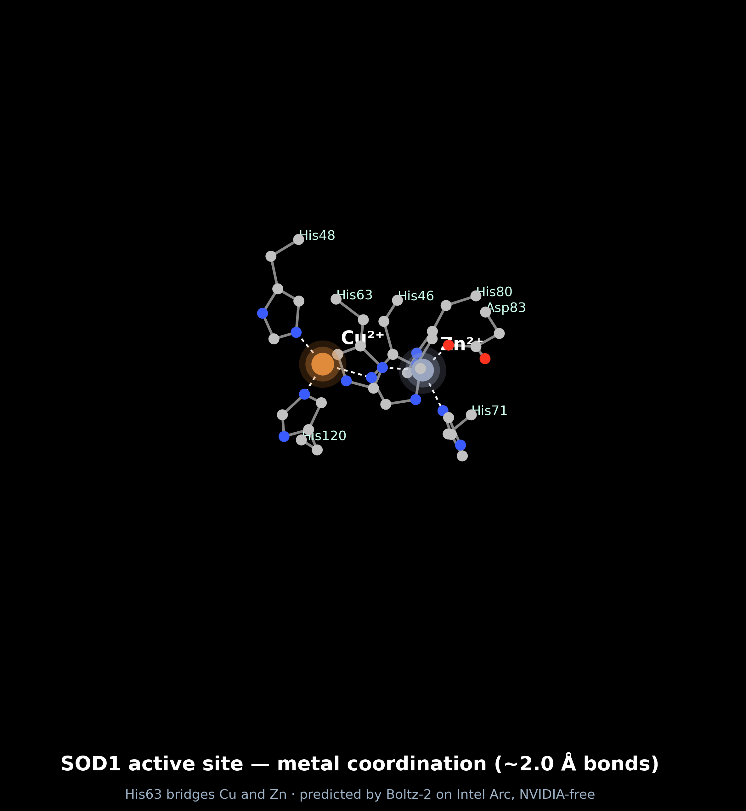
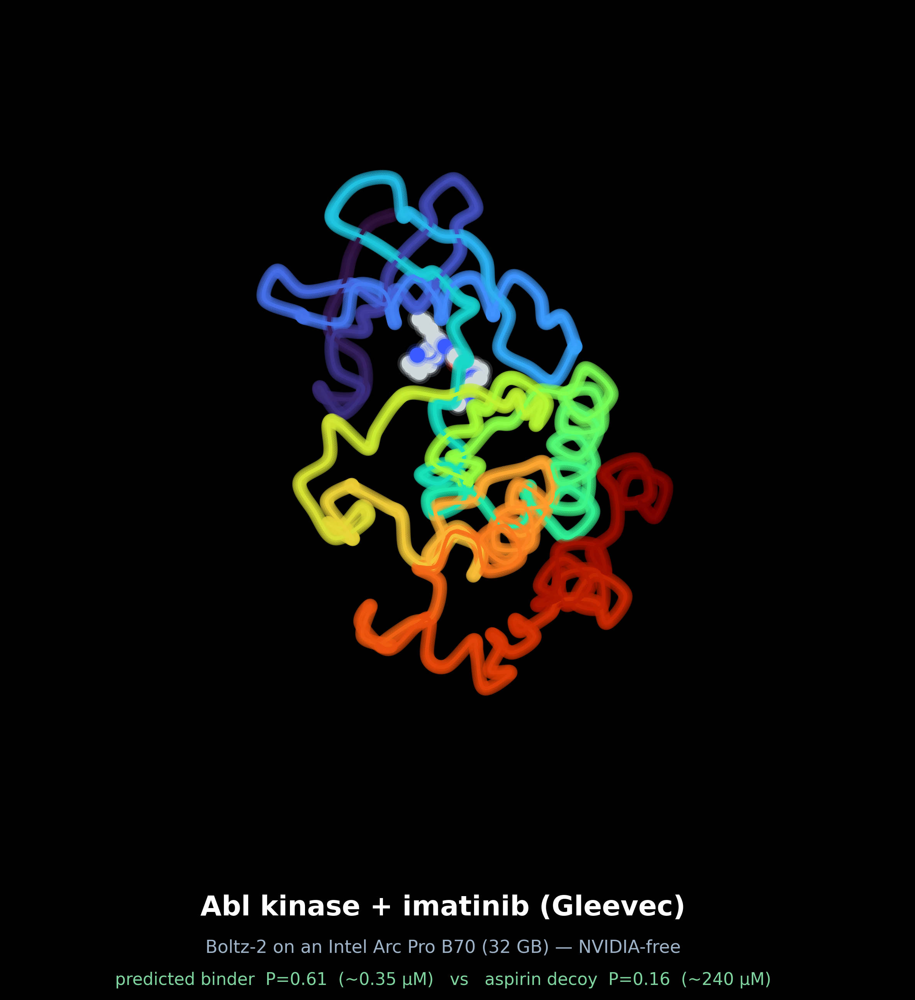
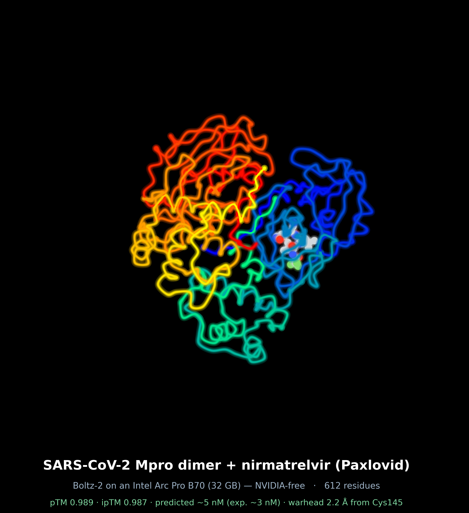
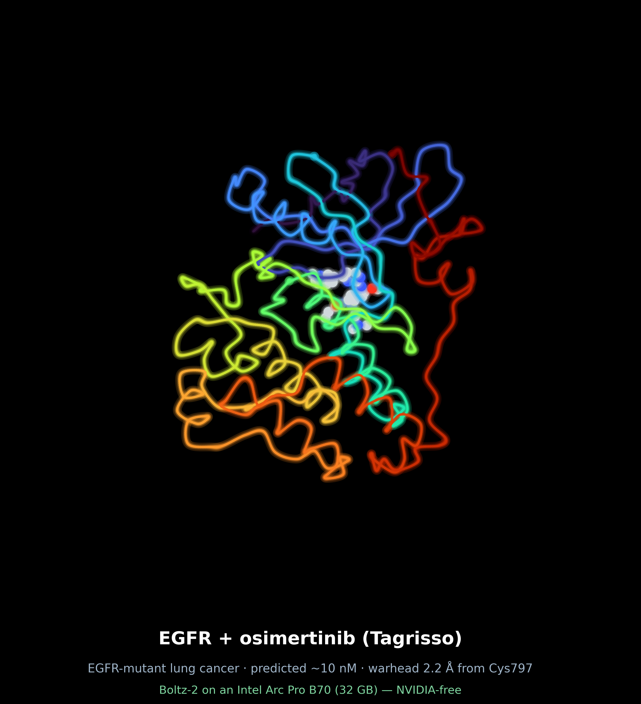
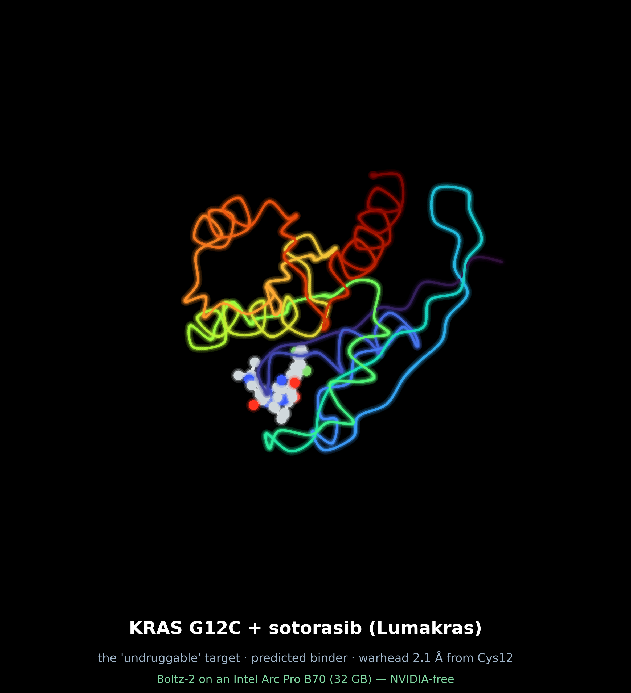
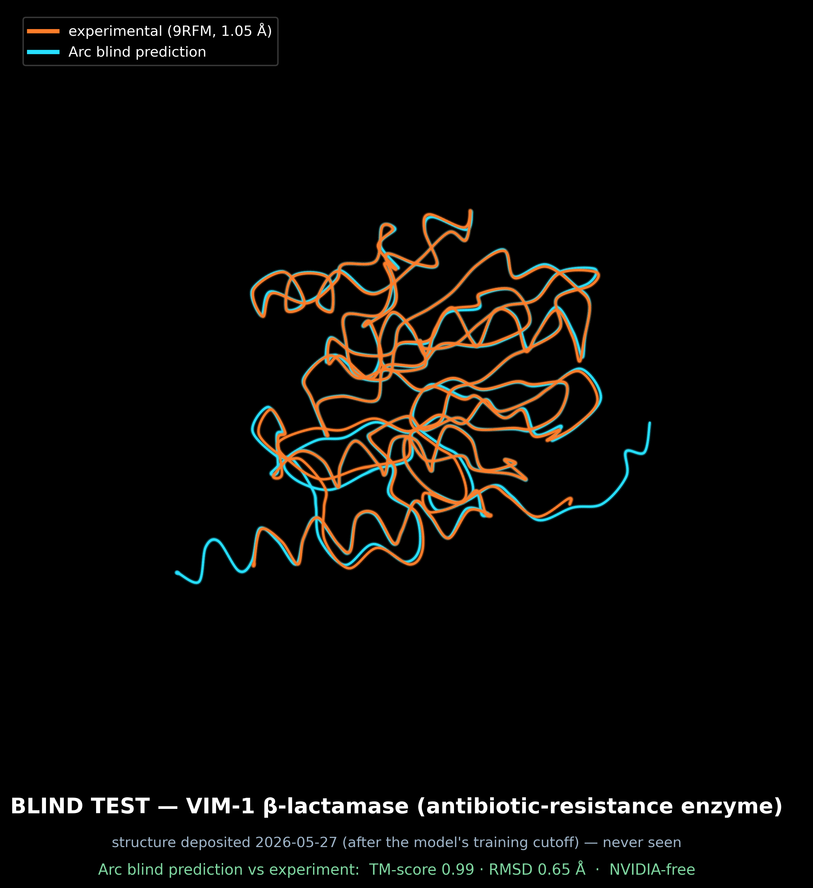

# Boltz-2 on Intel Arc

Running the [Boltz-2](https://github.com/jwohlwend/boltz) biomolecular structure +
binding-affinity model (an AlphaFold3-class predictor) on **Intel Arc Battlemage**
GPUs via `torch.xpu` / oneAPI / Level-Zero — **no CUDA, no NVIDIA hardware**.
Demonstrated on **both** a consumer **Arc B580** (12 GB, ~$250 — a gaming card)
**and** an **Arc Pro B70** (32 GB): the B580 folds protein structures at
experimental quality, and the B70's 32 GB unlocks the memory-heavy work —
protein–ligand binding affinity, multimer complexes, and a blind generalization
test.

**Built by [Dylan Holdren](mailto:Dylan@UniversalBasicInc.com) — Lead developer and founder, Universal Basic.**



*Human SOD1, predicted on a single Arc B580 — left: rainbow N→C; right: pLDDT
confidence (blue = high). Render: [`img/render_sod1.py`](img/render_sod1.py).*

## Quick start

On an Intel Arc Battlemage box (Linux), fold a protein in three commands:

```bash
git clone https://github.com/UniversalBasicInc/boltz2-intel-arc
cd boltz2-intel-arc
./setup.sh                     # one-time: builds the GPU stack + installs Boltz-2 (no sudo)
./fold.sh examples/sod1.yaml   # → out_sod1/  (structure + confidence JSON)
```

`setup.sh` is a one-time install (~10–15 min, mostly downloading torch-xpu + the
GPU userspace stack); after that, every fold is a single command. **Fold your
own:** point `fold.sh` at any sequence (`.fasta`) or Boltz YAML — e.g.
`./fold.sh my.fasta`. Hardware/OS notes and the full example set are under
[Reproduce / run your own folds](#reproduce--run-your-own-folds).

## Result

Human **superoxide dismutase 1 (SOD1)**, UniProt
[P00441](https://www.uniprot.org/uniprotkb/P00441), 154 residues, folded on a
single Arc B580:

| Metric | Value |
| --- | --- |
| Confidence | **0.967** |
| pTM | **0.967** |
| pLDDT (complex) | **0.967** |
| Atoms / residues | 1117 / 154 |
| Fold time — structure prediction (GPU) | **~17 s** |
| End-to-end — incl. MSA + model load | **~46 s** |
| GPU | Intel Arc B580 (Battlemage G21), 12 GB |
| Cost of GPU | ~$250 |

Prediction + confidence in [`examples/`](examples/). To our knowledge this is the
**first Boltz-2 run on Intel Arc / SYCL**, and the first AlphaFold3-class
binding-affinity model on Intel GPUs. The closest prior art is OpenFold on Intel's
**datacenter** Max-series / Ponte Vecchio GPUs via Intel Extension for PyTorch
([SC'24](https://doi.org/10.1109/SCW63240.2024.00128)); this work differs on three
axes — the newer **Boltz-2** model (with binding affinity), a **consumer Arc** card,
and **native `torch.xpu`** rather than the now-EOL IPEX.

### Holo SOD1 — the metalloenzyme active site

Re-folding with SOD1's **Cu²⁺ (catalytic) + Zn²⁺ (structural)** cofactors
(pTM **0.980**), Boltz-2 placed both ions in the *correct physiological active
site* with textbook ~2.0 Å coordination — Cu by His46/48/120, Zn by
His63/71/80 + Asp83, with **His63 bridging both metals**:



Not just a backbone — reconstructed coordination chemistry, still on the 12 GB
**Arc B580** (the ~$250 gaming card), NVIDIA-free.

### Binding affinity — Gleevec vs the Abl kinase (on a 32 GB Arc Pro B70)

Boltz-2's headline capability is **binding-affinity prediction**. On an Intel
**Arc Pro B70 (32 GB)**, predicting the affinity of the Abl kinase domain (the
chronic-myeloid-leukemia target) for **imatinib (Gleevec)** vs an **aspirin
decoy** — full quality (8192-deep MSA, 5 affinity samples):

| Ligand | log₁₀ IC50 (µM) | ≈ IC50 | P(binder) |
| --- | --- | --- | --- |
| **Imatinib (Gleevec)** | **−0.46** | **~0.35 µM** | **0.61** |
| Aspirin (decoy) | +2.38 | ~240 µM | 0.16 |

The model ranks the real drug **~700× tighter** than the decoy and calls it a
binder — *discrimination*, not just a score. (Imatinib's absolute value is ~1 log
weaker than its experimental ~10–40 nM, within Boltz-2's typical error.)



This is the drug-discovery story: rank a cancer drug against its target — and
reject a non-binder — NVIDIA-free, on Intel Arc.

### Flagship — SARS-CoV-2 Mpro dimer + Paxlovid (612 residues, Arc Pro B70, 32 GB)

The job the 12 GB card couldn't touch: the **obligate Mpro homodimer**
(2 × 306 aa) with **nirmatrelvir (Paxlovid)** bound and scored — multimer +
ligand + binding affinity in a single prediction.

| Metric | Value |
| --- | --- |
| pTM / ipTM | **0.989 / 0.987** — dimer reconstructed |
| ligand ipTM | **0.997** |
| Predicted affinity | **~5 nM**, P(binder) **0.999** — experimental Kᵢ **~3 nM** |
| Warhead → catalytic **Cys145** | **2.2 Å** (nirmatrelvir's real covalent target) |
| Ligand | 35 heavy atoms (C₂₃F₃N₅O₄, exact formula) |

Boltz-2 folded the dimer, docked Paxlovid into **one** protomer's active site
(the other empty — correct 1:1 occupancy), placed the nitrile warhead **2.2 Å**
from Cys145's sulfur, and predicted affinity within ~2× of experiment — all in
~2.5 minutes on a single **Arc Pro B70**.



### Lung-cancer panel — EGFR & KRAS targeted therapies

> *Dedicated to the memory of **Paul** (see [DEDICATION.md](DEDICATION.md)).*

The two pillars of modern non-small-cell lung-cancer treatment — each a covalent
inhibitor, docked onto the exact cysteine it was designed to bind, both folded on
the **Arc Pro B70**:

| Target + drug | pTM | Predicted affinity | P(binder) | Warhead → Cys |
| --- | --- | --- | --- | --- |
| **EGFR + osimertinib** (Tagrisso) | 0.955 | ~10 nM | 0.89 | **2.2 Å → Cys797** |
| **KRAS G12C + sotorasib** (Lumakras) | 0.976 | ~0.18 µM | 0.94 | **2.1 Å → Cys12** |

Both acrylamide warheads land ~2.2 Å from their target cysteine — the covalent
mechanism, predicted. And sotorasib is correctly ranked a **stronger, more
confident binder of KRAS G12C than of wild-type KRAS** (P 0.94 vs 0.78) — the
mutation selectivity that decides which patients the drug is prescribed to.
(Margin is modest: sotorasib's selectivity is largely covalent, which Boltz-2's
non-covalent affinity head doesn't fully model — an honest limitation.)




## Why this exists

The promise: full-scale protein structure prediction on commodity Intel GPUs,
free of the NVIDIA/CUDA lock-in that currently gates computational structural
biology. The Boltz-2 model itself is already nearly device-agnostic — its only
CUDA-specific dependency (NVIDIA cuEquivariance) is optional and auto-disabled
on non-CUDA hardware. The real work was getting a **coherent, non-crashing
Intel GPU compute stack** underneath PyTorch, and a thin Lightning shim on top.

Notably, **Boltz-2 itself needed zero source changes.** Everything Arc-specific
lives in a ~40-line launcher ([`scripts/run_boltz.py`](scripts/run_boltz.py)).

## What it took (short version)

1. **A coherent Level-Zero / NEO / IGC / gmmlib stack.** The stock Debian 13
   driver (`libze-intel-gpu1` 25.44 + Level-Zero loader 1.20.6) **segfaults** on
   any SYCL `half_fp_config` query — a NULL `zeDeviceGetVectorWidthPropertiesExt`
   call. The loader was too old to dispatch that extension. Fixed with a
   version-matched userspace stack (loader 1.29 + NEO 26.05 + IGC 2.28.4 +
   gmmlib 22.9.0) shadowed via `LD_LIBRARY_PATH` — **the system driver is never
   modified.**
2. **A PyTorch-XPU init-order fix.** Calling `torch.xpu.is_available()` /
   `device_count()` *before* `torch.xpu.init()` poisons init and segfaults. The
   launcher calls `torch.xpu.init()` first.
3. **A custom PyTorch Lightning XPU accelerator.** Lightning 2.5 ships
   `cpu/cuda/mps/tpu` but no `xpu`; the launcher registers one and pins a
   `SingleDeviceStrategy` on `xpu:0`.

The full debugging story and the Intel-actionable findings are in
[`docs/FINDINGS.md`](docs/FINDINGS.md).

## Reproduce / run your own folds

On an Intel Arc (Battlemage) box running Linux with the `xe` kernel driver:

```bash
./setup.sh                          # one-time: GPU stack + torch-xpu + Boltz-2 (no sudo)
./fold.sh examples/sod1.yaml        # reproduce the SOD1 result above
./fold.sh examples/egfr_osi.yaml    # …or any input in examples/ (EGFR, KRAS, Mpro, …)
./fold.sh my_protein.fasta          # …or your own sequence
```

Each run writes a PDB structure + confidence/affinity JSON to `out_<name>/`. The
[`examples/`](examples/) folder ships every input shown above (SOD1, holo SOD1,
Abl ± imatinib, EGFR + osimertinib, KRAS-G12C/WT + sotorasib, Mpro + Paxlovid,
and the VIM-1 blind test).

Under the hood `fold.sh` sources the GPU env and runs `scripts/run_boltz.py` (the
~40-line XPU launcher) — call it directly if you want full control over Boltz's
flags. See [`docs/REPRODUCE.md`](docs/REPRODUCE.md) for the exact environment +
version matrix, and [`docs/FINDINGS.md`](docs/FINDINGS.md) for the bring-up
details.

## Verified component matrix

| Layer | Package | Version |
| --- | --- | --- |
| Kernel driver | `xe` (in-tree) | Linux 6.19 |
| Level-Zero loader | `libze1` | **1.29.0** |
| Compute runtime (NEO) | `libze-intel-gpu1` | **26.05.37020.3** |
| Graphics compiler | `intel-igc-core-2` / `intel-igc-opencl-2` | **2.28.4** |
| Memory mgmt | `libigdgmm12` | **22.9.0** |
| PyTorch | `torch` (XPU) | 2.14 nightly (≥2.6 should work) |
| Model | `boltz` | 2.2.1 (no `[cuda]` extra) |

These versions are **version-locked together** (see FINDINGS §3). Mixing them
with the stock components is what produces the crashes.

## Status & roadmap

- [x] SOD1 (protein-only) — high-confidence fold (pTM 0.967) — **Arc B580, 12 GB**
- [x] Holo SOD1 with Cu²⁺ / Zn²⁺ — metals in the correct active site (pTM 0.980) — **Arc B580, 12 GB**
- [x] Protein–ligand **binding affinity** — Abl kinase + imatinib vs decoy — **Arc Pro B70, 32 GB**
- [x] **Large multimer + drug** — SARS-CoV-2 Mpro dimer + Paxlovid, 612 aa — **Arc Pro B70, 32 GB**
- [x] **Lung-cancer panel** — EGFR+osimertinib & KRAS-G12C+sotorasib (warheads on Cys797/Cys12) — **Arc Pro B70** — *for Paul*
- [ ] bf16-mixed precision (currently fp32 for stability)
- [ ] Native Lightning XPU accelerator upstream

## Accuracy — validated against experimental structures

Boltz-2 runs the *same* trained weights on Arc as on NVIDIA, so the bar is
parity — and Arc clears it. Scoring Arc predictions against experimental crystal
structures with US-align (TM-score / RMSD — full method in
[docs/BENCHMARK.md](docs/BENCHMARK.md)):

| Arc prediction | Experimental reference | TM-score | Cα RMSD |
| --- | --- | --- | --- |
| SOD1 | 2C9V (1.07 Å human SOD1) | **0.988** | **0.72 Å** |
| SOD1 | 1PU0 (independent crystal) | 0.992 | 0.62 Å |
| Mpro dimer | 7VH8 (Mpro + nirmatrelvir) | **0.999** | **0.24 Å** |
| **VIM-1 (blind)** | 9RFM (released 2026-05-27) | **0.992** | **0.65 Å** |

The last row is a **true blind test**: VIM-1 (an antibiotic-resistance enzyme)
was folded from sequence alone on the **Arc Pro B70**, and its experimental structure was **publicly
released** (2026-05-27; deposited under embargo 2025-06-04) *after* the model's
training cutoff — so its coordinates were not in any training set. Arc predicted
it to 0.65 Å (experimental quality), and the model's self-confidence tracked the
real accuracy. Generalization, not recall:



TM-score >0.9 means "essentially the same structure"; these are at the top of
the range Boltz-2 achieves on NVIDIA — i.e. **no accuracy penalty for leaving
CUDA**, with sub-Ångström backbone RMSD. Reproduce:
`scripts/validate_vs_experimental.sh`.

**vs. documented NVIDIA Boltz-2** (same model, same weights): accuracy parity is
**by construction** — Arc runs the identical trained weights, so the agreement
with experimental crystal structures above (0.24–0.72 Å) is the vendor-neutral
proof. On speed, a production NVIDIA **L40S** deployment reports **~40–60 s per
prediction**; our Arc SOD1 run is **~46 s end-to-end** (~17 s GPU — near-identical
on the B580 and B70, since SOD1 is small / MSA-bound) — the same regime. (An independent evaluation, [Wan et al. 2026](https://arxiv.org/abs/2603.05532),
is *more critical* of Boltz-2's affinity resolution for lead-identification — but
that's a property of the model, not the GPU; Arc reproduces whatever the weights
do.) Full citations in
[docs/BENCHMARK.md](docs/BENCHMARK.md).

## Beyond AI — real FP64 on Arc

The B70 also does **IEEE-correct double precision** at a usable rate (~1.4
TFLOPS, ~1/14 of fp32 — not crippled emulation), opening genuine double-precision
science (MD, quantum chemistry, CFD) on Arc, NVIDIA-free. See
[docs/FINDINGS.md](docs/FINDINGS.md) §7 and `scripts/bench_precision.py`.

## Contact

Questions, reproduction help, or collaboration:
**Dylan Holdren** · Lead developer and founder, Universal Basic · [Dylan@UniversalBasicInc.com](mailto:Dylan@UniversalBasicInc.com)

## Dedication

The lung-cancer panel in this project (EGFR + osimertinib, KRAS&nbsp;G12C +
sotorasib) is dedicated to the memory of **Paul** — see
[DEDICATION.md](DEDICATION.md).

## License

MIT (see [`LICENSE`](LICENSE)). Boltz-2 is MIT-licensed by its authors; this
repository is independent integration/porting work and is not affiliated with
the Boltz team or Intel.
